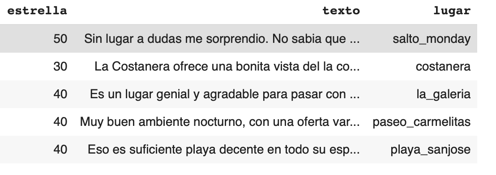
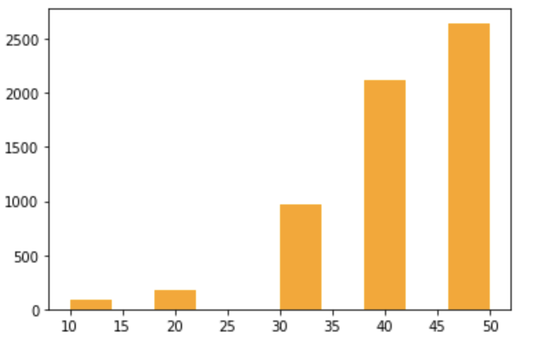

## Análisis de Sentimiento de lugares históricos del Paraguay basado en Técnicas de Procesamiento del Lenguaje Natural.

Este proyecto conocido como Análisis de Sentimiento de lugares históricos del Paraguay basado en Técnicas de Procesamiento del Lenguaje Natural está dentro del área de estudio de la Universidad Comunera, enfocado en los esquemas y aprendizajes de Machine Learning. Con el desarrollo de nuevos algoritmos en la búsqueda del modelado del texto principalmente en inglés, nos hemos visto con la necesidad de implementar estos conceptos en el español. Hemos abarcado desde la generación de un dataset sobre opiniones que tienen turistas que llegan a nuestro país acerca de los distintos lugares que visitan hasta generar modelos de bolsas de palabras (bag of words) o de incrustaciones(embeddings) para encontrar el algoritmo adecuado para este tipo de representación. 

## Video de demostración
Se puede observar la demostración en el siguiente  [video](https://drive.google.com/file/d/1jTnrPCBaEKChJhC9uhkoo-gew13zMBWA/view?usp=sharing).

### Dataset
El dataset tiene el nombre de [reviews_original.csv](https://github.com/edmenciab733/ucom-project3/blob/main/reviews_original.csv), si quiere realizar prueba pude exportar a su drive, exporte la misma y ejecute el proyecto en .

### Histograma de distribución de Estrella del dataset

